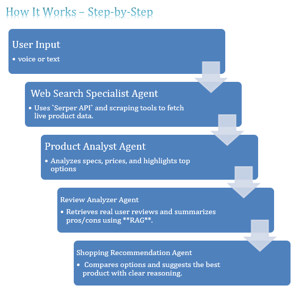

# 🛍️ ShopSmart.AI - Intelligent Shopping Assistant with CrewAi
Welcome to the **ShopSmart.AI** repository! This project is an **Intelligent Shopping Assistant** designed to enhance your shopping experience using CrewAi, providing personalized product recommendations and efficient assistance.

========

## Table of Contents

1. [Overview](#overview)
2. [Features](#features)
3. [Tech Stack](#tech-stack)
4. [Setup and Installation](#setup-and-installation)
5. [Usage](#usage)
6. [Contributing](#contributing)
7. [License](#license)

---

## 🚀 Features

- **Personalized Recommendations**: Get smart shopping suggestions based on user preferences and behavior.
- **Multi-Agent System**: Powered by **CrewAi**, intelligent agents collaborate to streamline the shopping journey.
- **Voice & Text Input**: Use voice or text to interact with the assistant for seamless shopping.
- **Product Search & Comparison**: Search across multiple platforms and compare products.
- **Review Summarization**: Analyze and summarize reviews with **RAG** (Retrieval-Augmented Generation).
- **User-Friendly Interface**: Built with **Streamlit** for easy and intuitive navigation.

---

## 🛠️ Technologies, Tools & Gen AI Capabilities Mapping (Updated)

| Tool / Library                 | Purpose                                                                 | Gen AI Capability Demonstrated                         |
|-------------------------------|-------------------------------------------------------------------------|--------------------------------------------------------|
| `CrewAI`                      | Manages agents and orchestrates multi-step processes                    | ✅ Multi-Agent Collaboration                           |
| `SerperDevTool`               | Searches the web for product listings                                   | ✅ Information Retrieval for RAG                       |
| `ScrapeWebsiteTool`           | Scrapes data from product listing websites                              | ✅ Data Collection for downstream processing           |
| `WebsiteSearchTool + RAG`     | Retrieves and summarizes user reviews                                   | ✅ Retrieval-Augmented Generation (RAG)                |
| `Google Gemini LLM`           | Provides reasoning, analysis, and natural language output               | ✅ Structured Output / JSON Mode<br>✅ Review Summarization |
| `LiteLLM`                     | Runs Gemini LLMs efficiently                                            | ✅ Efficient LLM Inference                             |
| `Google Embeddings`           | Used for document retrieval in RAG setup                                | ✅ Vector Search for RAG                               |
| `Colab + Python`              | Development environment                                                 | ✅ Experimentation and Prototyping                     |
| `speech_recognition`          | Converts user voice into text                                           | ✅ Voice-to-Text Input (Integrated!)                   |

---


--------
## Setup and Installation

Follow these steps to set up and run the project locally:

1. **Clone the Repository**:
   ```bash
   git clone https://github.com/SheemaMasood381/Intelligent-Shopping-Assistant-with-CrewAi.git
   cd Intelligent-Shopping-Assistant-with-CrewAi
   ```

2. **Create a Virtual Environment** (Optional but recommended):
   ```bash
   python3 -m venv venv
   source venv/bin/activate   # For Linux/Mac
   venv\Scripts\activate      # For Windows
   ```

3. **Install Required Dependencies**:
   ```bash
   pip install -r requirements.txt
   ```

4. **Run the Application**:
   ```bash
   python app.py
   ```

---

## Usage

1. Open the application in your web browser by navigating to `http://localhost:5000` (or the specified port).
2. Explore the features, including personalized recommendations, price comparison, and shopping list management.

---

## Contributing

We welcome contributions from the community to make ShopSmart.Ai even better! If you'd like to contribute:

1. Fork the repository.
2. Create a new branch for your feature or bugfix:
   ```bash
   git checkout -b feature-name
   ```
3. Commit your changes:
   ```bash
   git commit -m "Add feature-name"
   ```
4. Push to your branch:
   ```bash
   git push origin feature-name
   ```
5. Create a pull request.

---

## License

This project is licensed under the [MIT License](LICENSE). Feel free to use, modify, and distribute this project as per the license terms.

---

## Contact

For any questions or feedback, feel free to reach out:

- **GitHub**: [SheemaMasood381](https://github.com/SheemaMasood381)
- **Email**: sheemamasood381@gmail.com

---
