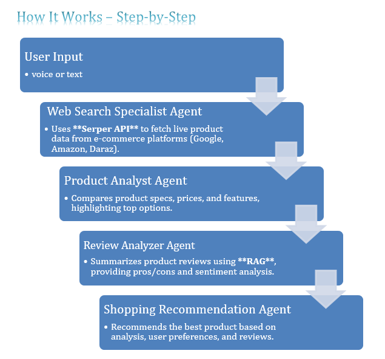

# ShopSmart.AI - Intelligent Shopping Assistant with CrewAi


Welcome to the `ShopSmart.AI` repository! This project is an Intelligent Shopping Assistant built using CrewAi, designed to enhance your shopping experience by providing smart recommendations and efficient assistance.

## Features
- **Smart Recommendations**: Get personalized shopping suggestions based on your preferences and past behavior.
- **Agent-Based System**: Utilize CrewAi's intelligent agents to streamline your shopping journey.
- **Interactive Interface**: User-friendly interface built with streamlit for seamless navigation.
- **Data Analysis**: Analyze shopping trends and preferences using Jupyter Notebooks.
- **Backend Integration**: Python-powered backend for robust and scalable performance.
- **Enterprise Deployment**: Leverage CrewAi Enterprise Framework for deployment using the `agents.py`, `crew.py`, and `task.py` and 'Dockerfile' files.




## Tech Stack
This project is built using:
- **HTML** (43.2%) for creating the interactive and responsive user interface.
- **Jupyter Notebook** (43.1%) for data analysis and visualization.
- **Python** (13.7%) for backend logic and integration with CrewAi.

  

## Getting Started

1. **Clone the Repository**:
   ```bash
   git clone https://github.com/SheemaMasood381/Intelligent-Shopping-Assistant-with-CrewAi.git
   cd Intelligent-Shopping-Assistant-with-CrewAi
   ```

2. **Install Dependencies**:
   Make sure you have Python installed. Install the required libraries using:
   ```bash
   pip install -r requirements.txt
   ```

3. **Run the Application**:
   Start the application using the following command:
   ```bash
   python app.py
   ```

4. **Open in Browser**:
   Navigate to `http://localhost:5000` in your web browser to start using ShopSmart.AI.

## Project Structure
```
.
├── agentic_flow.png      # Visual representation of the agentic flow in the system
├── agents.py             # Framework file for defining intelligent agents
├── crew.py               # Core CrewAi framework integration
├── task.py               # Task management and orchestration
├── ShopSmartAssistant.ipynb   # Jupyter Notebooks for testing 
├── app.py                # Main application script
├── requirements.txt      # Dependencies
└── README.md             # Project documentation
```

## Agentic Flow
The image above (`flow.png`) illustrates the flow of agents in the system, showcasing how different agents collaborate to provide a seamless shopping experience.

## Deployment with CrewAi Enterprise Framework
This project supports deployment using the CrewAi Enterprise Framework. The following Python files are crucial for setting up and managing agents for deployment:
- **`agents.py`**: Defines the intelligent agents used in the system.
- **`crew.py`**: Handles the core integration with the CrewAi framework.
- **`task.py`**: Manages task orchestration and execution.

## Contributions
Contributions are welcome! Feel free to fork the repository, create a branch, and submit a pull request.

## License
This project is licensed under the [MIT License](LICENSE).

---
**Happy Shopping with ShopSmart.AI!**
